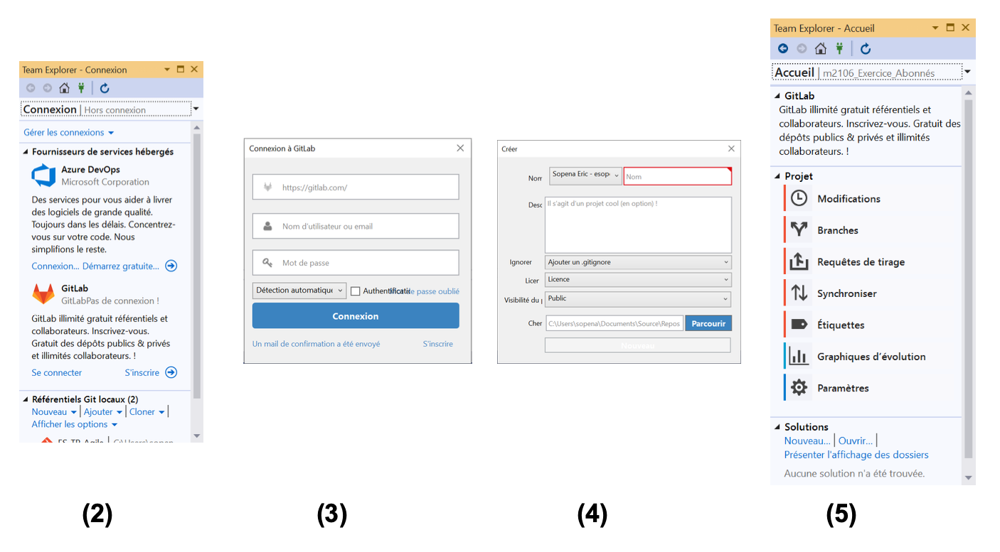

[](https://gitlab-ce.iut.u-bordeaux.fr/Pierre/m2106_bd_agile/pipelines)

# Comment dupliquer ce dépôt

<!-- Vous pouvez `forker` ce projet (la fourchette en haut à droite sur la page principale du dépôt) dans votre espace pour travailler tranquillement sur une copie privée, ou `commiter` dans ce dépôt si vous avez les droits de `Developer`.
Mais lors du `fork` l’organisation (`issues`, `milestones`, `labels`) est réinitialisée. -->

L'un des membres de l'équipe (`maintainer`) doit réaliser cette étape.

Pour faire une copie intégrale du dépôt, il faut passer par la fonction `export/import` de `Gitlab` :  https://docs.gitlab.com/ee/user/project/settings/import_export.html .
La démarche est alors la suivante :
- depuis `Gitlab` : créer un nouveau projet (le `+` dans le bandeau principal), sélectionner `import project` puis  `from Gitlab export`,
- donner un nom au nouveau projet (par exemple `m2106_bd_agile_import`) et choisir le fichier d'export (par exemple :
https://gitlab-ce.iut.u-bordeaux.fr/Pierre/m2106_bd_agile/-/blob/master/2020-04-30_08-53-552_Pierre_m2106_bd_agile_export.tar.gz),
- lancer `import project`,
- vous avez votre copie personnelle du dépôt.

# Organisation en équipes

Vous disposez d'un serveur `Discord` pour le module "M2204/M2106 - Méthodes Agiles et Bases de Données". Une fois que vous serez nommés sous le format "GxEy Nom Prénom" (avec `x` votre groupe et `y` votre numéro d'équipe dans le groupe) vous serez automatiquement affectés dans les canaux texte/audio correspondant à votre équipe.

# Utilisation de Gitlab pour gérer son projet

Voici les étapes à suivre pour gérer efficacement votre projet.

## Constituer son équipe

Le `maintainer` doit constituer son équipe :
-	inviter les autres membres de l’équipe en tant que `developer`,
-	inviter vos enseignants `C. Uny`, `P. Ramet` et `E. Sopena` en tant que `reporter`.

## Configurer Visual Studio

1. Installer l’extension `GitLab` (https://marketplace.visualstudio.com/items?itemName=MysticBoy.GitLabExtensionforVisualStudio),
puis exécuter `GitLab_Extension_for_Visual_Studio_v1.0.189.vsix`,
2. Sous `Visual Studio`, menu `Affichage / Team Explorer`,
3. Se connecter,
4. Créer dépôt (fenêtre `Team Explorer`), en ajoutant le `.gitignore` « visual studio »,
5. Bouton `Home` (fenêtre `Team Explorer`), vous êtes prêt à travailler !



## Définir et affecter une `issue` (ou `user-story`)

Si la tâche ne vous a pas encore été attribuée, rendez-vous dans la section `issues` et assignez-vous une `issue` ayant pour label `ToDo`. Les `issues` sont en fait des tâches à faire, elles peuvent être attribuées à une ou plusieurs personnes. Par défaut, nous avons les labels : `Open`, `ToDo`, `Doing`, `Closed`.

Vous pouvez aussi regrouper les `issues` par jalons (ou `milestones`), qui peuvent représenter par exemple des sprints dans une méthodologie agile. Le jalon est terminé lorsque toutes ses `issues` sont `Closed`.

***Note*** : Sous la présentation Gitlab `Board`, on peut déplacer facilement les différentes issues en fonction de leur état d’avancement.

## Créer une `merge request` pour débuter votre contribution

Une fois assigné, glissez l’`issue` vers le label `Doing`. Ouvrez ensuite l’`issue` puis cliquez sur `Create Merge Request`. Cette action va créer automatiquement une `merge-request` avec le statut `WIP` (Work In Progress). La branche de travail associée à cette dernière est également créée.
Dans votre environnement de développement, pensez à faire un `git pull` pour être sûr d’être à jour. La nouvelle branche que vous venez de créer a été synchronisée. Basculez sur cette branche avec un `git switch` (ou `git checkout` si votre `git` n'est pas suffisamment récent).

***Depuis `Visual Studio`*** :
-	onglet `Team Explorer / synchroniser / validations entrantes / tirer` pour mettre à jour votre copie locale,
-	puis aller sur `Branches / Remotes`, un double-clic sur la nouvelle branche pour qu’elle soit créée en local et pour pouvoir basculer dessus.

***Note*** : Vous avez toujours accès au dépôt https://gitlab-ce.iut.u-bordeaux.fr/Pierre/DEMO-GIT-PT2 pour un rappel des commandes `git` vues au début du semestre 2.

## Passez en mode relecture (ou `review`)

Une fois l’`issue` traitée, allez voir dans `GitLab` votre `merge-request`. Il se peut que vous ayez des conflits à régler. Vous pouvez tenter de les résoudre automatiquement sur l'interface web de `GitLab`, ou via votre environnement de développement. Une fois résolu, faites un `git commit` pour valider votre `merge`.

On vous recommande de `rebaser` votre branche de travail par rapport à la branche stable (`master` ou `develop`). Des conflits vont probablement apparaître si des contributions ont été intégrées entre temps sur la branche stable. Résolvez-les puis faites un `git rebase -continue` pour valider votre `merge`.

Vérifiez sur `GitLab` que votre problème de `Merge Conflit` a bien disparu.
Puis, cliquez sur `Resolve Wip Status` afin de montrer que le travail est terminé pour cette `merge-request`.

## Attendre les relectures de vos co-équipiers

Prenez en compte les retours proposés par vos relecteurs. Pensez à fermer les discussions pour chaque commentaire lorsque vous avez résolu le problème.
Si tout s’est bien passé, votre relecteur se chargera de faire le `Merge` final de votre branche. L'`issue`sera automatiquement fermée (`Closed`).

***Note*** Vous pouvez mentionner une `issue` dans le message associé à vos `commit` pour y faire référence. Un message `fix issue #xxx` (avec `xxx` le numéro de l'`issue`) fermera automatiquement cette `issue`. Vous pouvez également faire référence à une autre `merge-request` avec un message contenant `#yyy` (avec `yyy` le numéro de la `merge-request`).

## En tant que relecteur

Une fois un premier `commit` effectué, il est possible de discuter directement sur la contribution (`merge-request`). Il faut alors ouvrir l'onglet `Changes`. Normalement, en tant que `Developer` vous n'avez pas les droits pour `Merger` cette `issue` dans la branche `master` du dépôt principal. Lorsque vous avez fini votre relecture et que vous n'avez plus de remarques, vous pouvez `lever le pouce` pour indiquer que de votre point de vue, cette `issue` peut-être fusionnée.

## Conditions nécessaires pour fusionner une `merge-request`

Comme dit précédemment, vous devez régler les conflits (`Merge Conflit`) et retirer le statut `WIP` de votre `merge-request`.

Dans `Settings/General/Merge Requests/Merge checks`, il est conseillé de définir les règles suivantes :

- [x] `Pipelines must succeed`
- [x] `All discussions must be resolved`

Vous pouvez également imposer que votre contribution soit `rebasée` avant d'être fusionnée en sélectionnant dans `Settings/General/Merge Requests/Merge method` l'une des deux méthodes suivantes :

- [x] `Merge commit with semi-linear history`
- [ ] `Fast-forward merge`

Vous trouverez également deux fichiers cachés à la racine de ce dépôt :

- `.gitignore` : pour définir les règles afin d'ignorer les fichiers temporaires Visual Studio,
- `.gitlab-ci.yml` : pour mettre en place un pipeline d'intégration continue minimal.

## Estimation du temps d'une `issue`

Il est possible de saisir des estimations du temps passé sur une `issue` en écrivant dans le champs commentaire :
- /estimate \<temps\> : pour ajouter une estimation
- /spend \<temps\> : pour indiquer le temps passé

Le temps se décline en :
- mo : mois
- w : semaines
- d : jours
- h : heures
- m : minutes

La barre de progression du jalon pourra en tenir compte.

# Comment conserver un fichier de configuration privé

Pour ce projet orienté "bases de données", vous allez devoir utiliser un serveur `SQL Server` local sous `Windows` (voir https://gitlab-ce.iut.u-bordeaux.fr/Pierre/m2106_bd/-/blob/master/README.md).

Afin de travailler en équipe, on vous demande de versionner votre code sur le `Gitlab` de l'IUT. Depuis l'interface `Visual Studio`, dans le menu gérant les extensions, vous trouverez un `plugin` pour `Gitlab` (https://marketplace.visualstudio.com/items?itemName=MysticBoy.GitLabExtensionforVisualStudio). On vous recommande de l'utiliser. Vous pourrez ainsi visualiser vos branches (crées manuellement ou par `merge-request`) de manière graphique sans passer par une ligne de commande.

Il reste cependant un problème : votre `url` de connexion à la base de données doit rester privée (elle est nécessairement différente pour chaque co-équipier et ne doit pas être versionnée). La solution consiste à "stocker" cette `url` dans un fichier de configuration. Voici alors la ligne de code pour ouvrir une connexion :
```cs
using System.Configuration;
...
dbCon = new OleDbConnection(ConfigurationManager.ConnectionStrings["MyConnectionString"].ConnectionString);
```
en supposant que le fichier de configuration de l'application (`App.config` à la racine du projet) contienne, par exemple :
```xml
<?xml version="1.0" encoding="utf-8" ?>
<configuration>
    ...
    <connectionStrings>
      <add name="MyConnectionString" connectionString="Provider=SQLOLEDB;Data Source=DESKTOP-FATLC4L;Initial Catalog=Championnat;Integrated Security=SSPI" />
    </connectionStrings>
</configuration>
```

***Note*** C'est également dans ce fichier de configuration que vous allez retrouver votre version du framework `.NET` (on vous recommande d'utiliser la même version).

Pour finir, il est nécessaire d'ignorer ce fichier (`App.config`) lors des futurs `commits`.
- Soit vous avez ignoré ce fichier depuis le début en l'ajoutant dans le fichier `.gitignore` du projet.
- Soit vous pouvez l'ignorer a posteriori (par exemple si vous avez suivi la procédure ci-dessus pour "importer" le projet initial) à l'aide de la commande :
```bash
git update-index --skip-worktree path/to/file
```

# Ressources du cours

Les supports de cours sont disponibles :
- sur `Moodle` pour la parte `Agile` : https://moodle1.u-bordeaux.fr/course/view.php?id=5598
- sur `Moodle` pour la partie `BD` : https://moodle1.u-bordeaux.fr/course/view.php?id=1465
- et sur le dépôt `Gitlab` : https://gitlab-ce.iut.u-bordeaux.fr/Pierre/m2106_bd

## Les bases de données

Dans le sous répertoire `databases` vous trouverez :

- la base `Championnat` : https://gitlab-ce.iut.u-bordeaux.fr/Pierre/m2106_bd_agile/-/blob/master/databases/championnat/Championnat_0_Creation.sql
- la base `Modules` : https://gitlab-ce.iut.u-bordeaux.fr/Pierre/m2106_bd_agile/-/blob/master/databases/modules/Modules_0_Creation.sql
- la base `MusiqueSQL` : https://gitlab-ce.iut.u-bordeaux.fr/Pierre/m2106_bd_agile/-/blob/master/databases/README.md

## Les supports

Dans le sous répertoire `supports` vous trouverez :

- les rappels `SQL` : https://gitlab-ce.iut.u-bordeaux.fr/Pierre/m2106_bd_agile/-/blob/master/supports/M2106-1-SQL.pdf
- le support `Transact-SQL` : https://gitlab-ce.iut.u-bordeaux.fr/Pierre/m2106_bd_agile/-/blob/master/supports/M2106-2-TSQL.pdf
- le support `C#` avec `OLEDB` : https://gitlab-ce.iut.u-bordeaux.fr/Pierre/m2106_bd_agile/-/blob/master/supports/M2106-3-OLEDB.pdf
- le support `C#` avec `EF` : https://gitlab-ce.iut.u-bordeaux.fr/Pierre/m2106_bd_agile/-/blob/master/supports/M2106-4-EF.pdf

## Les exemples de code

Dans le sous répertoire `exemples` vous trouverez :

- 2 applications `WindowsForms` avec `OleDb` :
  - avec la base `MusiqueSQL` - 2 `ListBox` pour afficher les musiciens et leurs oeuvres : https://gitlab-ce.iut.u-bordeaux.fr/Pierre/m2106_bd_agile/-/blob/master/exemples/OLEDB_Musiciens_WindowsForms_App/README.md
  - avec la base `Championnat` - Mise à jour des joueurs : https://gitlab-ce.iut.u-bordeaux.fr/Pierre/m2106_bd_agile/-/blob/master/exemples/OLEDB_Championnat_Update_App/README.md

- 2 applications `WindowsForms` avec `Entity Framework` :
  - avec la base `MusiqueSQL` - 2 `ListBox` pour afficher les musiciens et leurs oeuvres : https://gitlab-ce.iut.u-bordeaux.fr/Pierre/m2106_bd_agile/-/blob/master/exemples/EF_Musiciens_WindowsForms_App/README.md
  - avec la base  `Championnat` - Mise à jour des joueurs : https://gitlab-ce.iut.u-bordeaux.fr/Pierre/m2106_bd_agile/-/blob/master/exemples/EF_Championnat_Update_App/README.md

# Quelques ressources complémentaires

- https://makina-corpus.com/blog/metier/2019/gitlab-astuces-projets
- https://www.youtube.com/watch?v=tv4UM1ruQRs
- https://www.youtube.com/watch?v=Ddd3dbl4-2w
- https://docs.gitlab.com/ee/user/project/issue_board.html
- https://docs.gitlab.com/ee/user/project/milestones/
