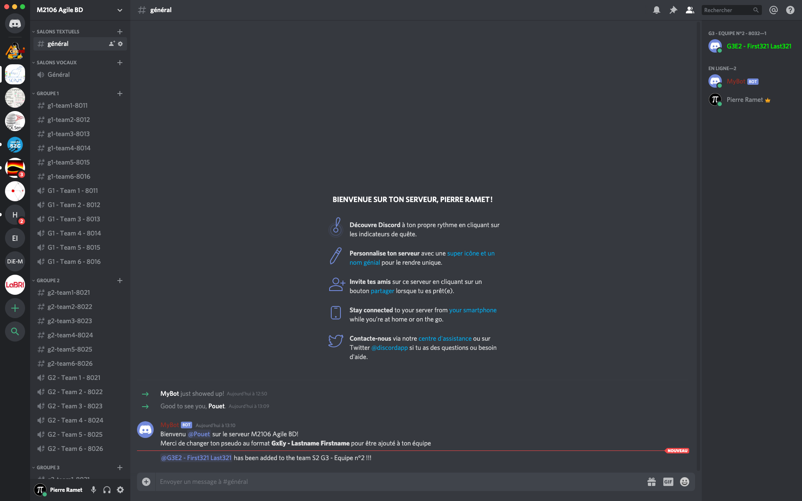
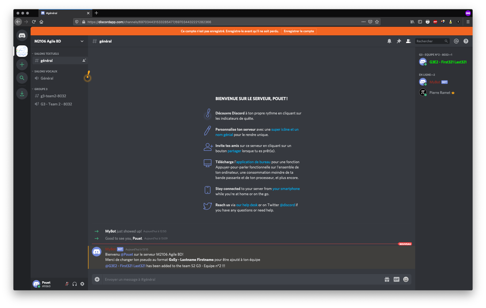

# Bot Discord

Création d'un bot `Discord` pour la génération automatique d'un serveur composé de :
- plusieurs groupes d'étudiants,
- dans chaque groupe, plusieurs équipes,
- pour chaque groupe, un regroupement `Discord`,
- pour chaque groupe (et rôles ou membres du groupe) une couleur spécifique,
- pour chaque équipe, une liste d'étudiants,
- pour chaque équipe, 2 canaux de discussion privés (texte et audio).

## Imposer un format de nommage

Le bot demande à chaque nouveau participant de se renommer sous la forme : "GxEy - Firstname Lastname".

Il vérifie que l'étudiant ainsi renommé appartient bien au bon groupe et à l'équipe mentionnée (GxEy) d'après un fichier XML (au format généré par l'outil de gestion de projet Thor à l'Enseirb : https://thor.enseirb-matmeca.fr/). Voir un exemple dans le fichier `m2106.xml` pour 4 groupes, 6 équipes par groupe, 5 étudiants par équipe.

## Affecter le bon rôle

Une fois l'étudiant renommé en respectant le format, le bot s'occupe de lui affecter le rôle correspondant à son équipe afin qu'il puisse voir les deux canaux (texte et audio) correspondant.

Une fois l'étudiant affecté dans un groupe, il ne peut plus en changer automatiquement, même s'il se renomme avec le format d'une autre équipe. Seul l'intervention d'un enseignant pourra l'aider à changer d'équipe.

*** Remarque *** : Le rôle 'enseignant' est automatiquement créé, mais le bot ne s'occupe pas d'affecter le rôle aux enseignants, même s'ils sont déclarés dans le fichier XML. (TODO)

## Déployer le bot

La procédure pour déployer un bot en `Python` est décrite ici : https://discordpy.readthedocs.io/en/latest/discord.html .

*** Note *** : Ne pas oublier de donner le rôle "administrateur" une fois le bot inscrit sur le serveur.

Voici la liste des dépendances `Python` :
~~~bash
pip3 install discord
pip3 install lxml
~~~

Il faut bien sûr spécifier dans `test.py` :
- l'identifiant du serveur : `guild_id`,
- l'identifiant du bot : `client.run()`.

Pour lancer le bot :
```bash
python3 test.py
```

## Captures d'écran

La vue de l'administrateur :



La vue d'un étudiant :




